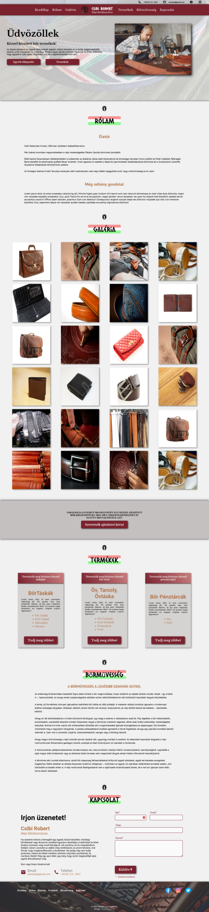

# Csibi Robert - Népi Bőrdíszműves portfólió

Ez a projekt egy többoldalas, statikus portfólió weboldal, amely kézzel készített bőrtermékeket mutat be. A felület magyar nyelvű, reszponzív elrendezést használ, külön termékkategória-oldalakat tartalmaz, valamint egy kapcsolatfelvételi űrlapot is biztosít.

## Projekt célja

A weboldal célja, hogy bemutassa a bőrdíszműves munkáit, a főbb termékkategóriákat, a galériát, valamint lehetőséget adjon az érdeklődőknek az egyedi megrendelés felvételére.

## Fő funkciók

- nyitóoldal bemutatkozó szekcióval
- "Rólam" és "Bőrművesség" tartalmi blokkok
- dinamikusan felépített galéria a főoldalon
- lightboxos képnagyítás a galériában
- külön aloldalak a táskák, övek és pénztárcák számára
- mobilbarát hamburger menü
- EmailJS alapú kapcsolatfelvételi űrlap
- vissza a tetejére gomb görgetés után

## Használt technológiák

- HTML5
- CSS3
- JavaScript
- EmailJS
- Remix Icon
- Font Awesome

## Oldalszerkezet

- `index.html`: főoldal, galéria, bemutatkozás, kapcsolat
- `bags.html`: táskák aloldal
- `belt.html`: övek, tarsolyok és övtáskák aloldala
- `wallets.html`: pénztárcák aloldala
- `css/style.css`: fő stílusok
- `css/media-query.css`: reszponzív töréspontok
- `css/fonts.css`: betűkészletek betöltése
- `js/app.js`: főoldali interakciók
- `js/subapp.js`: aloldalak képgalériája és mobilmenüje
- `assist/`: képek, ikonok és termékfotók

## Működés röviden

A főoldalon a galéria JavaScript segítségével épül fel az `assist/products/AllProduct` mappában található képekből. Az egyes termékoldalak hasonló módon, az aktuális oldal neve alapján töltik be a megfelelő kategóriaképeket és címeket. A kapcsolatfelvételi űrlap az EmailJS böngészős SDK-ját használja az üzenetküldéshez.

## Telepítés és futtatás

Mivel statikus weboldalról van szó, nincs szükség csomagtelepítésre.

1. Klónozd a repót:

```bash
git clone https://github.com/Thomas-Horvath/Leather_Portfolio-site.git
```

2. Nyisd meg a projektmappát.
3. Indítsd el az `index.html` fájlt böngészőben.

Egyszerű fejlesztői futtatáshoz használható például a VS Code Live Server bővítmény is.

## Fontos megjegyzések

- A kapcsolat szekcióban jelenleg minta telefonszám és minta e-mail cím szerepel.
- Több tartalmi blokkban még `Lorem ipsum` helykitöltő szöveg látható.
- Az EmailJS jelenlegi azonosítói közvetlenül a kliensoldali JavaScriptben szerepelnek.
- A külső ikon- és betűkészletforrások internetkapcsolatot igényelnek.

## Előnézet




